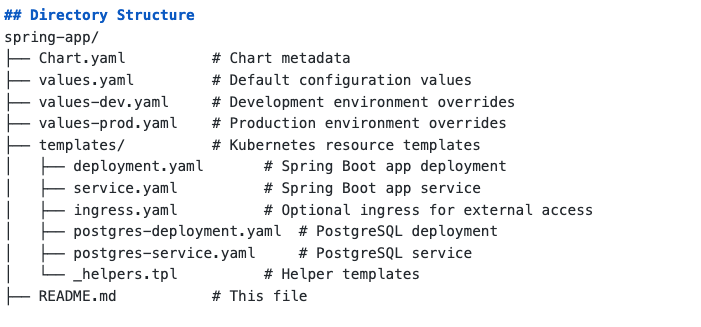

# Spring Boot Application Helm Chart

This Helm chart deploys a Spring Boot application with a managed PostgreSQL database on Kubernetes. It supports multiple environments (`dev` and `prod`) with customizable configurations.

## Prerequisites

- Kubernetes cluster (e.g., Minikube for local testing or a cloud provider like GKE, EKS)
- Helm 3.x installed
- Docker installed for building and pushing the Spring Boot image
- Access to a container registry (e.g., Docker Hub)

## Project Structure



## Deploy with Helm

### Production Environment

To deploy the Spring Boot application in the `prod` environment:

```bash
helm install spring-app-prod ./spring-app -f values-prod.yaml --namespace prod --create-namespace
```

### Development Environment
To deploy the Spring Boot application in the `dev` environment:

```bash
helm install spring-app-dev ./spring-app -f values-dev.yaml --namespace dev --create-namespace
```